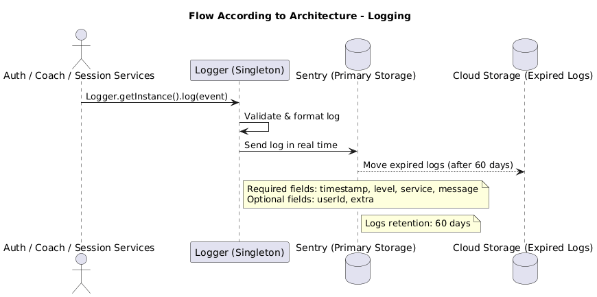
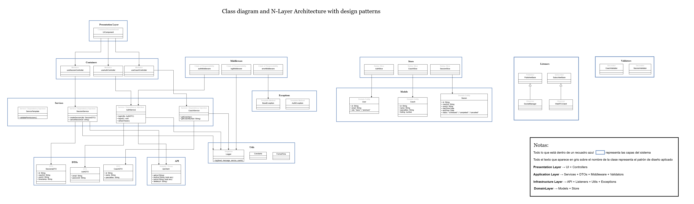

# 20minCoach — Frontend Architecture (Caso #1)

**Curso:** Course: Software Design / IC-6821

**Group:** 3 members
## Members
- Fiorella Chinchilla Ortiz - fichinchilla@estudiantec.cr
- Javier Rodriguez Menjivar - ja.rodriguez@estudiantec.cr
- Josue Salazar Quiros - jo.salazar@estudiantec.cr

## Brief Description
Platform for instant connection between users and coaches for 20-minute sessions. This repository contains the front-end architecture proposal, PoC, unit tests, and implementation documentation. 

### 1)Stack

- **Framework:** React + TypeScript  
- **State Management:** Redux Toolkit + RTK Query  
- **Styling:** Tailwind CSS  
- **Real-Time Video:** WebRTC (via Simple-Peer)  
- **Real-Time Notifications:** Socket.IO  
- **Authentication:** AWS Cognito  
- **Testing:**  
  - Unit & Component: Jest + React Testing Library  
  - End-to-End (E2E): Cypress  
- **UX Prototyping:** Figma  
- **UX Testing:** Useberry  
- **Linting & Formatting:** ESLint + Prettier  
- **Monitoring & Logging:** Sentry  
- **Build Tool:** Vite  
- **Deployment:** Vercel (Frontend Hosting)  
- **Version Control:** GitHub 

## 2)N-Layer Architecture Design
The /src directory follows a layered architecture (inspired by N-Layer and Clean Architecture).
Each layer has a single responsibility and communicates only with adjacent layers.
This structure improves maintainability, testability, and scalability of the frontend codebase.

### 2.1) Layers and Responsibilities

| Layer | Location | Responsibility | Design Patterns |
|------|----------|----------------|----------------|
| Presentation (UI) | [`/src/components`](https://github.com/Javo294/caso1DS/tree/main/src/components) | Renders views, user interaction, navigation | Container/Presentational |
| Containers | [`/src/containers`](https://github.com/Javo294/caso1DS/tree/main/src/containers) | Combines UI components with controllers | Container Pattern |
| Controllers | [`/src/controllers`](https://github.com/Javo294/caso1DS/tree/main/src/controllers) | Orchestrates use cases and service communication | Mediator, Hook-based |
| Models | [`/src/models`](https://github.com/Javo294/caso1DS/tree/main/src/models) | Core domain entities | DTO, Strategy (validation) |
| DTOs | [`/src/dto`](https://github.com/Javo294/caso1DS/tree/main/src/dto) | Data contracts with backend APIs | DTO |
| Services | [`/src/services`](https://github.com/Javo294/caso1DS/tree/main/src/services) | Business logic and API calls | Service, Dependency Injection |
| Store | [`/src/store`](https://github.com/Javo294/caso1DS/tree/main/src/store) | Global state management | Redux Toolkit slices |
| API | [`/src/api`](https://github.com/Javo294/caso1DS/tree/main/src/api) | Clients for external APIs and Auth | Adapter, Proxy |
| Listeners | [`/src/listeners`](https://github.com/Javo294/caso1DS/tree/main/src/listeners) | WebSockets, real-time events | Observer / Pub-Sub |
| Middleware | [`/src/middleware`](https://github.com/Javo294/caso1DS/tree/main/src/middleware) | Request/response interceptors, logging, auth | Chain of Responsibility |
| Exceptions | [`/src/exceptions`](https://github.com/Javo294/caso1DS/tree/main/src/exceptions) | Standardized error handling | Template Method |
| Utils | [`/src/utils`](https://github.com/Javo294/caso1DS/tree/main/src/utils) | Shared functions and helpers (logger, constants, formatting) | Singleton (logger) |
| Styles | [`/src/styles`](https://github.com/Javo294/caso1DS/tree/main/src/styles) | Tailwind configuration, themes | - |
| Validators | [`/src/validators`](https://github.com/Javo294/caso1DS/tree/main/src/validators) | Validation of models and DTOs | Decorator |

---

# 3)System Architecture & Development Standards

## 3.1)Logging
- **File:** [`/src/utils/logger.ts`](https://github.com/Javo294/caso1DS/blob/main/src/utils/logger.ts)  
- **Framework:** Sentry  
- **Base Class:** `Logger.ts` (Singleton)
- **3Required Fields:** timestamp, level, service, message  
- **Optional Fields:** userId  
- **Environment Variables:** `SENTRY_DSN`, `SENTRY_ENVIRONMENT`

# 3.1.1)Class Definition and Validators
The `Logger` class centralizes event logging in the application, ensuring consistency and correct formatting.

## 3.1.2)Log Fields
- **timestamp:** date and time of the event (ISO 8601).
- **level:** log level (ERROR, WARN, INFO, DEBUG).
- **service:** name of the service generating the log.
- **message:** descriptive message of the event.
- **userId** (optional): identifier of the user associated with the event.
- **extra** (optional): additional relevant information.

## 3.1.3)Validators / Formatters
- `timestamp` is automatically generated in ISO 8601 format.
- `level` is normalized according to the `LogLevel` enum.
- `service` is defined in the logger instance.
- `userId` is automatically obtained from `localStorage` based on authentication status.

# 3.1.4)Log Storage and Retention
Logs are sent to Sentry as the primary storage.
- **Service Name:** each log includes the `service` field to identify the source.
- **Retention Time:** 60 days.
- **Expiration:** expired records will be moved to less expensive storage, namely Google Cloud Storage, which reduces costs.

# 3.1.5)Flow According to Architecture

  
---

## 3.2)Background Jobs & Notifications
**3.2.1)Location:**  
- **Files:**  
  - [`/src/listeners/videoEvents.ts`](https://github.com/Javo294/caso1DS/blob/main/src/listeners/videoEvents.ts)  
  - [`/src/listeners/websocket.ts`](https://github.com/Javo294/caso1DS/blob/main/src/listeners/websocket.ts)  

**3.2.2)Technologies:**  
- **Socket.io** → real-time event notifications (e.g., session status, availability).  
- **Browser Notifications API** → local client-side notifications.  

**3.2.3)Observer Pattern:** 
-Publisher
-Subscriber

# PublisherBase
Create an abstract class `PublisherBase` (see "Creating Publishers" below) with a method `publish(event: string, payload: any)`.
All classes that send notifications must inherit from this class.

# SubscriberBase
Create an abstract class `SubscriberBase` (see "Creating Subscribers" below) with a method `handleEvent(event: string, payload: any)`.
All classes that receive events must inherit from this class.

# Creating Publishers
**Location:** [`/src/controllers/PublisherBase.ts`](https://github.com/Javo294/caso1DS/blob/main/src/controllers/PublisherBase.ts)
**Tasks:** 
- Create a class that inherits from `PublisherBase`.
- Implement the `publish` method to send events via Socket.io or another event bus.

# Creating Subscribers
**Location:** [`/src/listeners/SubscriberBase.ts`](https://github.com/Javo294/caso1DS/blob/main/src/listeners/SubscriberBase.ts)
**Tasks:**
- Create a class that inherits from `SubscriberBase`.
- Implement the `handleEvent` method to process the received event.
- Notify the user via Browser Notifications or by integrating a push service.

# 3.2.4)Additional Considerations

**Push Notification Provider:**
- Must map mobile devices (IMEI or token) to send specific notifications.

**Layer Separation:**
- **Publishers:** generate events → located in `controllers`.  
- **Subscribers:** receive events → located in `listeners`.

**Publisher Example:**  
[`/src/controllers/PublisherBase.ts`](https://github.com/Javo294/caso1DS/blob/main/src/controllers/PublisherBase.ts)

**Suscriber Example:**  
[`/src/listeners/SubscriberExcample.ts`](https://github.com/Javo294/caso1DS/blob/main/src/listeners/SubscriberExcample.ts)

---

## 3.3)Linter & Code Standards
**Configuration Files:**  
- ESLint: [`/src/linter/eslintrc.js`](https://github.com/Javo294/caso1DS/blob/main/src/linter/eslintrc.js)  
- Prettier: [`/src/linter/prettierrc.ts`](https://github.com/Javo294/caso1DS/blob/main/src/linter/prettierrc.ts)
- NPM scripts [`/src/linter/pakage.json`](https://github.com/Javo294/caso1DS/blob/main/src/linter/pakage.json):  

**Tools:** ESLint + Prettier  
- **Rules:**  
  - **Strict TypeScript typing** (`"strict": true` in `tsconfig.json`)  
  - **Absolute imports** allowed (`@/components`, `@/services`, etc.)  
  - **Naming conventions:**  
    - `PascalCase` → Components  
    - `camelCase` → Functions & variables  
  - **`any` type** only allowed with explicit documentation
 
  **Script de NPM:**
  Aquí va el código guía para el programador, falta agregarlo

  EN ESTA SECCIÓN HACEN FALTA MEJORAS
---

## 4)Services Layer
- **Examples:**  
  - [`/src/services/CoachService.ts`](https://github.com/Javo294/caso1DS/blob/main/src/services/CoachService.ts)  
  - [`/src/services/SessionService.ts`](https://github.com/Javo294/caso1DS/blob/main/src/services/SessionService.ts)
  - [`/src/services/ServiceTemplate.ts`](https://github.com/Javo294/caso1DS/blob/main/src/services/ServiceTemplate.ts )
- **Pattern:** Service + Dependency Injection

# Structure
src/
 └─ services/
     ├─ CoachService.ts
     ├─ SessionService.ts
     ├─ ServiceTemplate.ts  (parent class or interface for all services)
     
## ServiceTemplate.ts
- Base class inherited by each service.
- Contains permission validation and common methods.
- Serves as a reference for creating new services.

## Middlewares
- Each service can communicate with authorized middlewares.

---

## 5)Error Handling & Exceptions
- **Classes:**  
  - [`/src/exceptions/BaseException.ts`](https://github.com/Javo294/caso1DS/blob/main/src/exceptions/BaseException.ts) → abstract base class for custom errors.  
  - [`/src/exceptions/AuthException.ts`](https://github.com/Javo294/caso1DS/blob/main/src/exceptions/AuthException.ts) → handles authentication/authorization errors.  
  
- **Integration:**  
  - **React ErrorBoundary** → captures unhandled runtime errors in React components.  
  - **Sentry** → tracks, archives, and exports logs in accordance with organizational policies.  
- **Example Implementation:**  
  - [`/src/exceptions/ExceptionExample.ts`](https://github.com/Javo294/caso1DS/blob/main/src/exceptions/ExceptionExample.ts)

EN ESTA SECCIÓN HACE FALTA AGREGAR INFORMACIÓN

---

## 6)Middleware
**Implemented Redux Middleware:**  
  - [`/src/middleware/authMiddleware.ts`](https://github.com/Javo294/caso1DS/blob/main/src/middleware/authMiddleware.ts)→ validates authentication & permissions.  
  - [`/src/middleware/logMiddleware.ts`](https://github.com/Javo294/caso1DS/blob/main/src/middleware/logMiddleware.ts) → structured logging for requests and state changes.  
  - [`/src/middleware/errorMiddleware.ts`](https://github.com/Javo294/caso1DS/blob/main/src/middleware/logMiddleware.ts) → catches and forwards errors.  

- **Pattern:**  
  Implements **Chain of Responsibility**, where each middleware handles a specific concern and passes control to the next.  

# How to Use Middlewares

## Layers Where They Can Be Applied
- **authMiddleware** → only in the Services Layer, to validate permissions before executing business logic.  
- **logMiddleware** → can be applied in Services and Controllers, to record requests and state changes without affecting the main logic.  
- **errorMiddleware** → can be applied in any layer where exception handling is needed, including Services, Controllers, and Proxies.

## Integration with Logging and Exception Handling
- `logMiddleware` must integrate with the centralized Logger (Sentry) to maintain uniform traceability.  
- `errorMiddleware` must forward exceptions to the Logger and/or a monitoring service, following the log retention rules defined previously.

- **Usage Example:**
[`/src/middleware/index.ts`](https://github.com/Javo294/caso1DS/blob/main/src/middleware/index.ts)

---

## 7)Build & Deployment Pipeline
**Pipeline Stages:**  
  1. **Lint & Test** → runs ESLint + Jest tests to validate code quality.  
  2. **Build** → compiles with Vite.  
  3. **Deploy** → deploys automatically to Vercel.  

**Environment Configurations:**  
- [`/src/enviroment/env.development`](https://github.com/Javo294/caso1DS/blob/main/src/enviroment/env.development) → local development.  
- [`/src/enviroment/env.production`](https://github.com/Javo294/caso1DS/blob/main/src/enviroment/env.production) → production (Vercel).  

**Secret Management:**  
- Sensitive values stored in **Vercel Environment Variables**.
  
- **Basic Commands:**
[`/src/enviroment/BasicCommands.ts`](https://github.com/Javo294/caso1DS/blob/main/src/enviroment/BasicCommands.ts)

EN ESTA SECCIÓN FALTA AGREGAR INFORMACIÓN DE CONFIGURACIÓN DE ENTORNOS,Pipeline Stages...

---

## 8)Security & Validators
**Authentication Framework:** Auth0

**Authentication Screens:**  

**Configuration:**  
falta agregar

**Security Rules:**  

SR-01
Description: After receiving the role, the program redirects the user to the user page (called index). Depending on the role, some features are displayed while others are hidden.

Specification:

- Basic-user: Has access to the suggestion list (a grid with 8 boxes), the askComposer (where the user writes their query), and the user menu. The user menu is important because, exclusively for this role, there is a button that says “Upgrade to Premium” (basically the “poor man’s button”).

- Premium-user: Has access to everything above (except the “poor man’s button”), plus a sidebar that functions as a chat history.

Access Denied Behavior: This should not occur because the program directly shows or hides features based on the user’s role. It’s not even a case of disabling them—features simply do not appear.

Priority: Medium

Dependencies: None

---

## Validators

### Files
- [`/src/validators/CoachValidator.ts`](https://github.com/Javo294/caso1DS/blob/main/src/validators/CoachValidator.ts)
- [`/src/validators/SessionValidator.ts`](https://github.com/Javo294/caso1DS/blob/main/src/validators/SessionValidator.ts)

### Purpose
These validators enforce rules and constraints on the domain models before any business logic or API calls are executed. They follow the **Decorator** pattern to allow flexible and reusable validations.

### Example Usage
- [`/src/validators/ValidatorExample.ts`](https://github.com/Javo294/caso1DS/blob/main/src/validators/ValidatorExample.ts)

---

## 9)Session State

### Allowed States
- `requested` solicitud de sesión creada
- `accepted` sesión aceptada por el coach
- `inCall` sesión en progreso
- `ended` sesión finalizada

### Maximum Duration
- Each session lasts up to **20 minutes**.

### Subscription Plans
| Plan | Price | Sessions per Month |
|------|-------|------------------|
| Basic | $20  | 2 sessions       |
| Premium | $60 | 8 sessions       |

---

## 10)DTOs (Data Transfer Objects)

### Purpose
DTOs define the structure of the data that moves between the frontend and backend. They enforce contracts, ensure type safety, and simplify data transformations.

### Examples
- [`/src/dto/CoachDTO.ts`](https://github.com/Javo294/caso1DS/blob/main/src/dto/CoachDTO.ts)
- [`/src/dto/SessionDTO.ts`](https://github.com/Javo294/caso1DS/blob/main/src/dto/SessionDTO.ts)

### Transformation Example
Aquí va el código guía para el programador, falta agregarlo

---

## 11)State Management 
### Purpose
Manage global state in a predictable way using Redux Toolkit slices and hooks. Each slice is responsible for a specific domain (Auth, Coach, Session).

### Slices
- [`/src/store/useAuthStore.ts`](https://github.com/Javo294/caso1DS/blob/main/src/store/useAuthStore.ts)
- [`/src/store/useCoachStore.ts`](https://github.com/Javo294/caso1DS/blob/main/src/store/useCoachStore.ts)
- [`/src/store/useSessionStore.ts`](https://github.com/Javo294/caso1DS/blob/main/src/store/useSessionStore.ts)

### Example: 
- [`/src/store/stateExample.ts`](https://github.com/Javo294/caso1DS/blob/main/src/store/stateExample.ts)

---

## 12)Styles / Themes
### Purpose
Manage global styles, themes, and responsive design using Tailwind CSS.

### Files
- [`src/styles/index.css`](https://github.com/Javo294/caso1DS/blob/main/src/styles/index.css) → Global CSS import, Tailwind base, components, and utilities.
- [`/src/styles/tailwind.config.ts`](https://github.com/Javo294/caso1DS/blob/main/src/styles/tailwind.config.ts) → Tailwind configuration, custom colors, breakpoints, and plugins.
- [`/src/styles/themes.ts`](https://github.com/Javo294/caso1DS/blob/main/src/styles/themes.ts) → Theme definitions, e.g., dark/light mode, shared colors, font sizes.

### Example: 
- [`/src/styles/useTheme.ts`](https://github.com/Javo294/caso1DS/blob/main/src/styles/useTheme.ts)

---

## 13)Utilities / Helpers
### Purpose
Shared helper functions and constants used across the frontend. Includes formatting utilities, global constants, and logging.

### Files and Examples

- [`/src/utils/constants.ts`](https://github.com/Javo294/caso1DS/blob/main/src/utils/constants.ts)  
  Contains global constants for the application.

- [`/src/utils/formatTime.ts`](https://github.com/Javo294/caso1DS/blob/main/src/utils/formatTime.ts)  
  Utility functions for formatting date and time.

- [`logger.ts`](https://github.com/Javo294/caso1DS/blob/main/src/utils/logger.ts)  
  Singleton logger for application-wide logging using Sentry.
  

---

## 14)Diagrams

### 1. Class Diagram

### 2. Sequence Diagram - Login 

### 3. Sequence Diagram - Schedule Session

--- 

### 15)Design Patterns Applied

| Pattern | Usage |
|---------|-------|
| Singleton | Logger, Helpers |
| Strategy | Validators (CoachValidator, SessionValidator) |
| Observer / Pub-Sub | Listeners, Real-time Notifications |
| Chain of Responsibility | Middleware (logger, auth, error) |
| DTO | Data transfer between API and frontend models |

---

## 16)Installation/Execution Instructions

This project does not require any additional local software installation to view the prototype, as it is hosted on **Figma**.  

1. Go to the repository folder:  
   [`UX & Security/Prototipo.md`](./UX%20&%20Security/Prototipo.md)

2. Inside that document, you will find the direct link to the prototype.  
   You can also access it directly here:  
   [Prototype in Figma](https://boat-id-33315748.figma.site/)

3. Open the link in any up-to-date browser (Google Chrome or Mozilla Firefox is recommended).  
   - No additional installation is required.  
   - The prototype is interactive and can be navigated as if it were a real application.  

---

