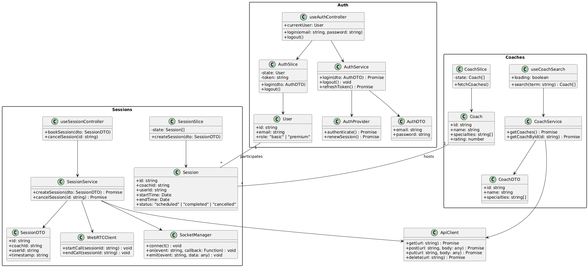
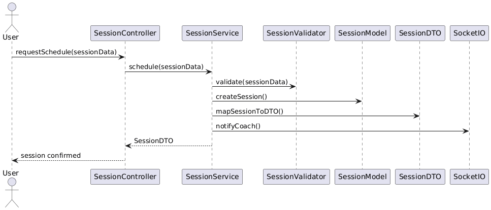

# 20minCoach — Frontend Architecture (Caso #1)

**Curso:** Course: Software Design / IC-6821

**Group:** 3 members
## Members
- Fiorella Chinchilla Ortiz - fichinchilla@estudiantec.cr
- Javier Rodriguez Menjivar - ja.rodriguez@estudiantec.cr
- Josue Salazar Quiros - jo.salazar@estudiantec.cr

## Brief Description
Platform for instant connection between users and coaches for 20-minute sessions. This repository contains the front-end architecture proposal, PoC, unit tests, and implementation documentation. 

### Stack

- **Framework:** React + TypeScript  
- **State Management:** Redux Toolkit + RTK Query  
- **Styling:** Tailwind CSS  
- **Real-Time Video:** WebRTC (via Simple-Peer)  
- **Real-Time Notifications:** Socket.IO  
- **Authentication:** AWS Cognito  
- **Testing:**  
  - Unit & Component: Jest + React Testing Library  
  - End-to-End (E2E): Cypress  
- **UX Prototyping:** Figma  
- **UX Testing:** Useberry  
- **Linting & Formatting:** ESLint + Prettier  
- **Monitoring & Logging:** Sentry  
- **Build Tool:** Vite  
- **Deployment:** Vercel (Frontend Hosting)  
- **Version Control:** GitHub 

## N-Layer Architecture Design
The /src directory follows a layered architecture (inspired by N-Layer and Clean Architecture).
Each layer has a single responsibility and communicates only with adjacent layers.
This structure improves maintainability, testability, and scalability of the frontend codebase.

### Layers and Responsibilities

| Layer | Location | Responsibility | Design Patterns |
|------|----------|----------------|----------------|
| Presentation (UI) | [`/src/components`](https://github.com/Javo294/caso1DS/tree/main/src/components) | Renders views, user interaction, navigation | Container/Presentational |
| Containers | [`/src/containers`](https://github.com/Javo294/caso1DS/tree/main/src/containers) | Combines UI components with controllers | Container Pattern |
| Controllers | [`/src/controllers`](https://github.com/Javo294/caso1DS/tree/main/src/controllers) | Orchestrates use cases and service communication | Mediator, Hook-based |
| Models | [`/src/models`](https://github.com/Javo294/caso1DS/tree/main/src/models) | Core domain entities | DTO, Strategy (validation) |
| DTOs | [`/src/dto`](https://github.com/Javo294/caso1DS/tree/main/src/dto) | Data contracts with backend APIs | DTO |
| Services | [`/src/services`](https://github.com/Javo294/caso1DS/tree/main/src/services) | Business logic and API calls | Service, Dependency Injection |
| Store | [`/src/store`](https://github.com/Javo294/caso1DS/tree/main/src/store) | Global state management | Redux Toolkit slices |
| API | [`/src/api`](https://github.com/Javo294/caso1DS/tree/main/src/api) | Clients for external APIs and Auth | Adapter, Proxy |
| Listeners | [`/src/listeners`](https://github.com/Javo294/caso1DS/tree/main/src/listeners) | WebSockets, real-time events | Observer / Pub-Sub |
| Middleware | [`/src/middleware`](https://github.com/Javo294/caso1DS/tree/main/src/middleware) | Request/response interceptors, logging, auth | Chain of Responsibility |
| Exceptions | [`/src/exceptions`](https://github.com/Javo294/caso1DS/tree/main/src/exceptions) | Standardized error handling | Template Method |
| Utils | [`/src/utils`](https://github.com/Javo294/caso1DS/tree/main/src/utils) | Shared functions and helpers (logger, constants, formatting) | Singleton (logger) |
| Styles | [`/src/styles`](https://github.com/Javo294/caso1DS/tree/main/src/styles) | Tailwind configuration, themes | - |
| Validators | [`/src/validators`](https://github.com/Javo294/caso1DS/tree/main/src/validators) | Validation of models and DTOs | Decorator |

---

# System Architecture & Development Standards

## Logging
- **File:** [`/src/utils/logger.ts`](https://github.com/Javo294/caso1DS/blob/main/src/utils/logger.ts)  
- **Framework:** Sentry  
- **Base Class:** `Logger.ts` (Singleton)  
- **Required Fields:** timestamp, level, service, message  
- **Optional Fields:** userId  
- **Environment Variables:** `SENTRY_DSN`, `SENTRY_ENVIRONMENT`  
- **Usage Example:** 
Aquí va el código guía para el programador, falta agregarlo
---

## 2. Background Jobs & Notifications
**Location:**  
- **Files:**  
  - [`/src/listeners/videoEvents.ts`](https://github.com/Javo294/caso1DS/blob/main/src/listeners/videoEvents.ts)  
  - [`/src/listeners/websocket.ts`](https://github.com/Javo294/caso1DS/blob/main/src/listeners/websocket.ts)  

**Technologies:**  
- **Socket.io** → real-time event notifications (e.g., session status, availability).  
- **Browser Notifications API** → local client-side notifications.  

**Design Pattern:** 
-Publisher
-Subscriber

**Publisher Example:**  
Aquí va el código guía para el programador, falta agregarlo
**Suscriber Example:**  
Aquí va el código guía para el programador, falta agregarlo

---

## 3. Linter & Code Standards
**Configuration Files:**  
- ESLint: `/.eslintrc.js`  
- Prettier: `/.prettierrc`  
- NPM scripts (`package.json`):  
  - `"lint": "eslint 'src/**/*.{ts,tsx}' --fix"`  

**Tools:** ESLint + Prettier  
- **Rules:**  
  - **Strict TypeScript typing** (`"strict": true` in `tsconfig.json`)  
  - **Absolute imports** allowed (`@/components`, `@/services`, etc.)  
  - **Naming conventions:**  
    - `PascalCase` → Components  
    - `camelCase` → Functions & variables  
  - **`any` type** only allowed with explicit documentation
 
  **Script de NPM:**
  Aquí va el código guía para el programador, falta agregarlo
---

## 4. Services Layer
- **Location:** [`/src/services`](https://github.com/Javo294/caso1DS/tree/main/src/services)  

- **Examples:**  
  - [`CoachService.ts`](https://github.com/Javo294/caso1DS/blob/main/src/services/CoachService.ts)  
  - [`SessionService.ts`](https://github.com/Javo294/caso1DS/blob/main/src/services/SessionService.ts)  

- **Pattern:** Service + Dependency Injection  

- **Restrictions:**  
  - Services **do not access the global state directly**.  
  - Services are exposed only through **Redux Toolkit slices**.  

- **Example Usage:**
    Aquí va el código guía para el programador, falta agregarlo
---

## 5. Error Handling & Exceptions
- **File:** [`/src/exceptions`](https://github.com/Javo294/caso1DS/tree/main/src/exceptions)  

- **Classes:**  
  - [`BaseException.ts`](https://github.com/Javo294/caso1DS/blob/main/src/exceptions/BaseException.ts) → abstract base class for custom errors.  
  - [`AuthException.ts`](https://github.com/Javo294/caso1DS/blob/main/src/exceptions/AuthException.ts) → handles authentication/authorization errors.  
  

- **Integration:**  
  - **React ErrorBoundary** → captures unhandled runtime errors in React components.  
  - **Sentry** → tracks, archives, and exports logs in accordance with organizational policies.  
- **Example Implementation:**  
Aquí va el código guía para el programador, falta agregarlo
---

## 6. Middleware
- **Location:** [`/src/middleware`](https://github.com/Javo294/caso1DS/tree/main/src/middleware)  

**Implemented Redux Middleware:**  
- [`authMiddleware.ts`](https://github.com/Javo294/caso1DS/blob/main/src/middleware/authMiddleware.ts) → validates authentication & permissions.  
  - [`logMiddleware.ts`](https://github.com/Javo294/caso1DS/blob/main/src/middleware/logMiddleware.ts) → structured logging for requests and state changes.  
  - [`errorMiddleware.ts`](https://github.com/Javo294/caso1DS/blob/main/src/middleware/errorMiddleware.ts) → catches and forwards errors.  

- **Pattern:**  
  Implements **Chain of Responsibility**, where each middleware handles a specific concern and passes control to the next.  

- **Usage Example:**
Aquí va el código guía para el programador, falta agregarlo
---

## 7. Build & Deployment Pipeline
**Location:** falta agregarla

**Pipeline Stages:**  
  1. **Lint & Test** → runs ESLint + Jest tests to validate code quality.  
  2. **Build** → compiles with Vite.  
  3. **Deploy** → deploys automatically to Vercel.  

**Environment Configurations:**  
- `.env.development` → local development.  
- `.env.production` → production (Vercel).  

**Secret Management:**  
- Sensitive values stored in **Vercel Environment Variables**.
- 
- **Basic Commands:**
Aquí va el código guía para el programador, falta agregarlo
---

## 8. Security & Validators
**Location:** falta agregar

**Authentication Framework:** falta agregar

**Authentication Screens:**  
falta agregar

**Configuration:**  
falta agregar

**Security Rules:**  
falta agregar

---

## Validators

### Files
- [`CoachValidator.ts`](https://github.com/Javo294/caso1DS/blob/main/src/validators/CoachValidator.ts)
- [`SessionValidator.ts`](https://github.com/Javo294/caso1DS/blob/main/src/validators/SessionValidator.ts)

### Purpose
These validators enforce rules and constraints on the domain models before any business logic or API calls are executed. They follow the **Decorator** pattern to allow flexible and reusable validations.

### Example Usage
Aquí va el código guía para el programador, falta agregarlo

---

## Session State

### Allowed States
- `requested`
- `accepted`
- `inCall`
- `ended`

### Maximum Duration
- Each session lasts up to **20 minutes**.

### Subscription Plans
| Plan | Price | Sessions per Month |
|------|-------|------------------|
| Basic | $20  | 2 sessions       |
| Premium | $60 | 8 sessions       |

---

## DTOs (Data Transfer Objects)

### Location
- [`/src/dto`](https://github.com/Javo294/caso1DS/tree/main/src/dto)

### Purpose
DTOs define the structure of the data that moves between the frontend and backend. They enforce contracts, ensure type safety, and simplify data transformations.

### Examples
- [`CoachDTO.ts`](https://github.com/Javo294/caso1DS/blob/main/src/dto/CoachDTO.ts)
- [`SessionDTO.ts`](https://github.com/Javo294/caso1DS/blob/main/src/dto/SessionDTO.ts)

### Transformation Example
Aquí va el código guía para el programador, falta agregarlo

---

## State Management 

### Location
- [`/src/store`](https://github.com/Javo294/caso1DS/tree/main/src/store)

### Purpose
Manage global state in a predictable way using Redux Toolkit slices and hooks. Each slice is responsible for a specific domain (Auth, Coach, Session).

### Slices
- [`useAuthStore.ts`](https://github.com/Javo294/caso1DS/blob/main/src/store/useAuthStore.ts)
- [`useCoachStore.ts`](https://github.com/Javo294/caso1DS/blob/main/src/store/useCoachStore.ts)
- [`useSessionStore.ts`](https://github.com/Javo294/caso1DS/blob/main/src/store/useSessionStore.ts)

### Example: 
Aquí va el código guía para el programador, falta agregarlo

---

## Styles / Themes

### Location
- [`/src/styles`](https://github.com/Javo294/caso1DS/tree/main/src/styles)

### Purpose
Manage global styles, themes, and responsive design using Tailwind CSS.

### Files
- [`index.css`](https://github.com/Javo294/caso1DS/blob/main/src/styles/index.css) → Global CSS import, Tailwind base, components, and utilities.
- [`tailwind.config.ts`](https://github.com/Javo294/caso1DS/blob/main/src/styles/tailwind.config.ts) → Tailwind configuration, custom colors, breakpoints, and plugins.
- [`themes.ts`](https://github.com/Javo294/caso1DS/blob/main/src/styles/themes.ts) → Theme definitions, e.g., dark/light mode, shared colors, font sizes.

### Example: 
Aquí va el código guía para el programador, falta agregarlo

---

## Utilities / Helpers

### Location
- [`/src/utils`](https://github.com/Javo294/caso1DS/tree/main/src/utils)

### Purpose
Shared helper functions and constants used across the frontend. Includes formatting utilities, global constants, and logging.

### Files and Examples

- [`constants.ts`](https://github.com/Javo294/caso1DS/blob/main/src/utils/constants.ts)  
  Contains global constants for the application.
  
Aquí va el código guía para el programador, falta agregarlo

- [`formatTime.ts`](https://github.com/Javo294/caso1DS/blob/main/src/utils/formatTime.ts)  
  Utility functions for formatting date and time.
  
Aquí va el código guía para el programador, falta agregarlo

- [`logger.ts`](https://github.com/Javo294/caso1DS/blob/main/src/utils/logger.ts)  
  Singleton logger for application-wide logging using Sentry.
  
Aquí va el código guía para el programador, falta agregarlo

---

## Diagramas

### 1. Diagrama de Clases  

### 2. Diagrama de Secuencia - Inicio de Sesión  

### 3. Diagrama de Secuencia - Agendar Sesión  

--- 

### Design Patterns Applied

| Pattern | Usage |
|---------|-------|
| Singleton | Logger, Helpers |
| Strategy | Validators (CoachValidator, SessionValidator) |
| Observer / Pub-Sub | Listeners, Real-time Notifications |
| Chain of Responsibility | Middleware (logger, auth, error) |
| DTO | Data transfer between API and frontend models |

---

## Installation/Execution Instructions

This project does not require any additional local software installation to view the prototype, as it is hosted on **Figma**.  

1. Go to the repository folder:  
   [`UX & Security/Prototipo.md`](./UX%20&%20Security/Prototipo.md)

2. Inside that document, you will find the direct link to the prototype.  
   You can also access it directly here:  
   [Prototype in Figma](https://boat-id-33315748.figma.site/)

3. Open the link in any up-to-date browser (Google Chrome or Mozilla Firefox is recommended).  
   - No additional installation is required.  
   - The prototype is interactive and can be navigated as if it were a real application.  

---

